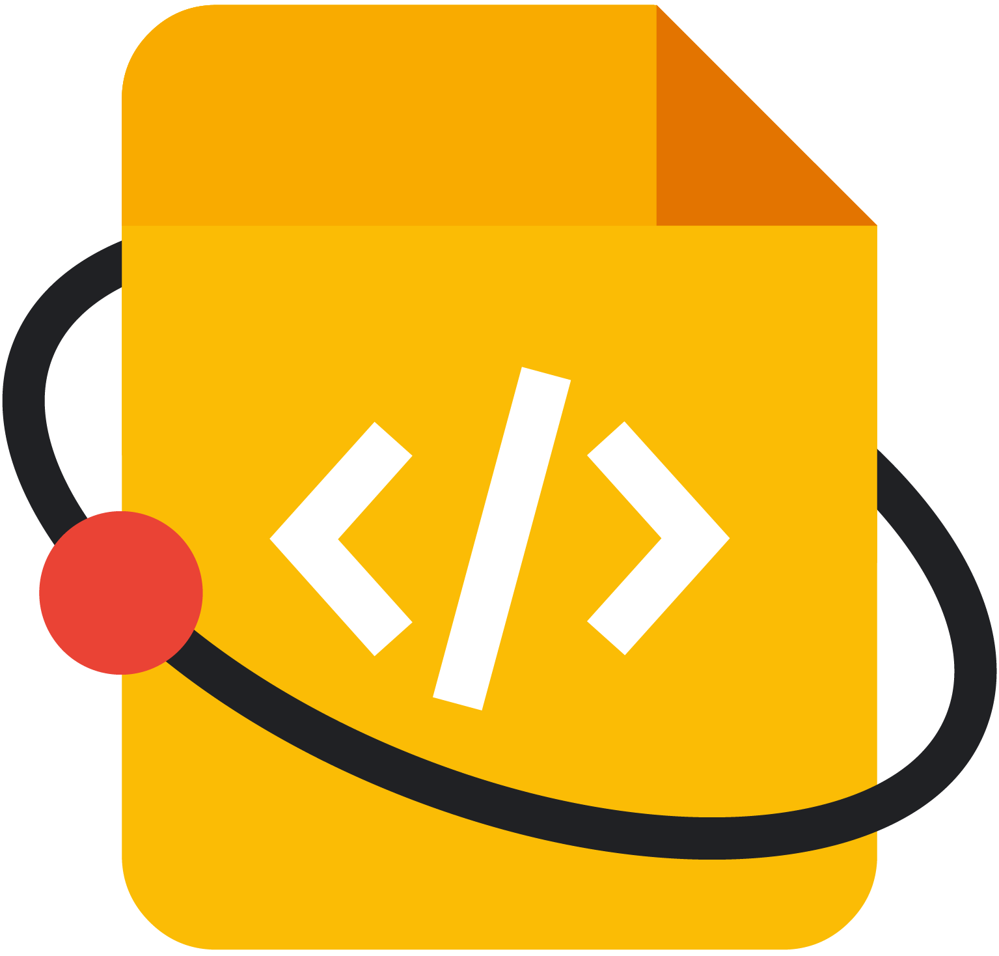

#
 

 

 

<h3>
 
Proposal for GSoD_2023 
 
for
 
AboutCode (Add reference documentation and getting started guides for PurlDB)
 
Mentors
 
<a href="https://github.com/pombredanne">Philippe Ombredanne</a>
 
<a href="https://github.com/AyanSinhaMahapatra">Ayan Sinha Mahapatra</a>
 
<a href="https://github.com/DennisClark">Dennis Clark</a>
</h3>

 

    

        Raj Gaurav Maurya  
    

    

        <a href="https://www.linkedin.com/in/rajgm29/">LinkedIn</a>  
    

    

        <a href="https://github.com/RajGM">Github</a>  
    

    

        <a href="https://twitter.com/RajGM_Hacks/">Twitter</a>  
    

    

        <a href="https://hashnode.com/@RajGM">HashNode</a>  
    

    

    <a href="https://drive.google.com/file/d/1G2vJkJVh-cUUYu9m6nzl6V8qIOKlk5TB/view?usp=sharing">Resume</a>
    

 
<ul> <li> <h2>About Me</h2>  <ul>
 <li> I am Raj Gaurav, a senior at UoL, a self-taught software engineer (full-stack web and mobile).</li>
  <li> Building InfiOpp </li> </ul> </li> <li> <h2>Experiences</h2> <ul><li> Instructor and Mentor at HackYourFuture Jan 10, 2023 - Current <ul> <li>Teaching full-stack development curriculum. </li> <li> Doing code review, providing feedback and taking TA session to unblock mentee.</li> </ul> <li> LFX Mentee at Hyperledger Nov 1, 2022 - Current <ul> <li>Developing a Cactus Chia connector plugin and test infrastructure from scratch. </li> <li> Building an end to end test cases powered by Jest and testing infrastructure to prove that connector is working as intended with locally simulated chai network.</li> </ul> <li> MLH Fellow at Solana May 29, 2022 - Aug 19, 2022 <ul> <li>Worked on the Hydra wallet project that allowed users to distribute funds with several parameters such as the membership model, and more using the Hydra-wallet SDK.</li> <li> Worked on the NFT-Mutator project that allows editing of the metadata stored on the wallet connected to the application using the Metaplex SDK.</li> </ul> <li> Software Engineer at DigitalProductSchool by UnternehmerTUM Sept 13, 2021 - 3 Dec, 2021 <ul> <li>Worked as a software engineer in a team of 5 people with a different role to solve the problem by building a product.</li> <li> Developed a full-stack application to increase the efficiency of internal work by 90 percent </li> <li>Developed the CI/CD pipeline to reduce deployment time from 4 minutes to 30 seconds.</li> </ul> </li> </ul> </li> <li> <h2>Skills</h2> <ul> <li> C++, JavaScript, HTML5/CSS3, Python, Bash, Go, React Native</li> <li> Node.js, Express.js, React.js, Next.js, Solana </li> <li> MongoDB, PostgresSQL, SQL </li> <li> Git, VS Code, Docker, Kubernetes, Jenkins, YAML </li> <li> Distributed systems, System Design, Computer Networks, Linux, GCP, IT Automation, Devops </li> </ul> </li> <li> <h2>Interests</h2> <ul> <li> API Documentation </li> <li> Technical Documentations </li> <li> How-To Guides </li> <li> Tutorials </li> <li> User Guides </li> <li> User Manual </li> <li>Feature Documentation </li> </ul> 
<li> <h2>Link to Blogs</h2> 
<ul>
<li>
<a href="https://rajgm.hashnode.dev/development-from-signals-to-software">Signals to Softwares</a> </li> 
<li>
<a href="https://rajgm.hashnode.dev/how-does-the-internet-work">How does internet works</a>
  </li> 
 <li>
 <a href="https://rajgm.hashnode.dev/internet-of-things">Internet of Things</a>
   </li> 
<li> 
<a href="https://rajgm.hashnode.dev/dev-retro-2022">Dev Retro 2022</a>
</li>
<li>
<a href="https://rajgm.hashnode.dev/productivity">Productivity</a></li> 
</ul>
</li> </ul> </li> </li> </ul> 

## Timeline

Keeping these milestones in mind the following timeline will be followed. 

<table>
  <tr>
   <td>
<strong>Dates</strong>
   </td>
   <td><strong>Tasks</strong>
   </td>
  </tr>
  <tr>
   <td>
   </td>
   <td>Community Bonding Period Begins
   </td>
  </tr>
  <tr>
   <td>April 1 - April 15
   </td>
   <td>Identifying and finalizing the exact approach with mentors, setting up the project development environment, Preparing a draft infrastructure (Repos / Build / Test)
   </td>
  </tr>
  <tr>
   <td>
   </td>
   <td>Community Bonding Period Ends
   </td>
  </tr>
  <tr>
   <td>April 16 - 30
   </td>
   <td>Complete docs for "Why use PurlDB" and "PurlDB Components"
   </td>
  </tr>
  <tr>
   <td>May 1 - May 15 
   </td>
   <td>Add reference for "How PurlDB works"
   </td>
  </tr>
  <tr>
   <td>May 16 - 30
   </td>
   <td>Update local dev installation and config documentation 

then this period will be utilized to solve other issues apart from this one.
   </td>
  </tr>
  <tr>
   <td>
   </td>
   <td>First Phase Completed
   </td>
  </tr>
  <tr>
   <td>June 1 - 15
   </td>
   <td>Update running visitors/mappers usuage guidelines
   </td>
  </tr>
  <tr>
   <td>June 16 - 30
   </td>
   <td>Enhance docs into RTD pages and sections and reiterating over the docs if required.
   </td>
  </tr>
</table>

 

## Time Commitments 

* The above timeline is tentative and is for providing a rough idea of the planned project work. Full efforts will be made to stick to it. A much more detailed schedule will be shared with the mentors during the community bonding period after finalizing the exact approach for the project. 
* The expected time commitment for GSoD this time is 20 hours/week. I have no prior commitments during the coding period so will easily be able to contribute for the necessary time (even more if need be). 
* My college summer break starts on March 15 and classes resume on May 15 (tentative).

 

# **General Notes**

I firmly believe that communication is one of the most important aspects of open source programs like GSoD. To make sure that the project status is communicated properly, I will be undertaking the following steps:

* Participating in standups and community meetings.
* Publishing a bi-weekly blog post detailing the work done, problems faced, and how they were resolved.
* Maintaining a google doc with daily updates. Even if I’m stuck on some issue I will be writing that down in the doc. I believe this is a very effective way of not only maintaining accountability but also ensuring smooth asynchronous communication.
* Contacting the mentors daily to keep them in the loop of the progress of the project.
* I will be available to communicate via Slack, Discord, and any other communication medium available via Internet (Video Conference, Audio Conference, etc).

 

## Past open source experience

I would like to share that I am a part of the Hyperledger organization.

Links: 

[orgs/LFX/Hyperledger/chia-connector](https://mentorship.lfx.linuxfoundation.org/project/fd61c1c4-1245-4f46-a942-d837333bcaaf)

[DraftPR for Cactus](https://github.com/RajGM/cactus/commit/04748bf54471a953602a3d365fbafc3fbdd91b51)

Over the semester, I improved myself with strategies on how to do multiple things at a time. As a result, I aced my capabilities. Working with various communities is what I'm most proud of. It taught me the importance of building a network and networking with folks.

This opportunity would also let me dive deeper into following good practices to write code and taking suggestions from communities via issues and incorporating them. Hence, I am applying with full enthusiasm for the same.

 

# **Post GSoD Plans**

I’m **not** applying for GSoD under any other organization this year since I am looking to learn in depth about PurlDB and use it in my side project.

Post the GSoD period I would love to continue contributing by improving the documentation not only to the opened issues but by creating new one as required.

Once the project is completed, I’ll try to provide mentorship, improve on boarding experience and bug fixes for it since I want to contribute to the project in some or another way. Apart from that, I’ll always be a part of the AboutCode community and will be following as well as contributing towards its development and documentation.

 

# _Special note for the reviewers_: 

I am flexible enough if the mentor/maintainer/organizer thinks to change anything from above as per the requirements. I have just divided the work into 90 days to make clear how to work efficiently these days. This process will surely lead to working closely with the mentors.

Additionally, I would like to add that as I am a total newbie, I am still having many doubts about implementation but I am sure enough that with the help of mentors, I will be able to perform the task assigned. Just to let you know, support while coding is highly appreciated!

I am an open-source enthusiast and would highly like to contribute further to the project/work assigned to me after the primary task has been implemented.

I would also additionally love to explore the core inner workings of the project and try to contribute to the same after the primary task has been implemented.